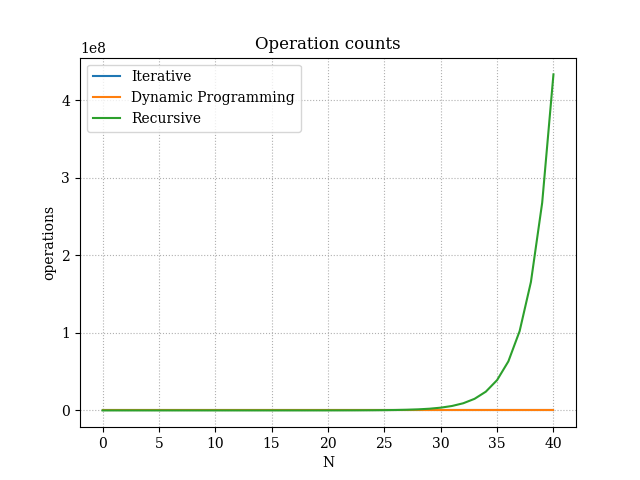
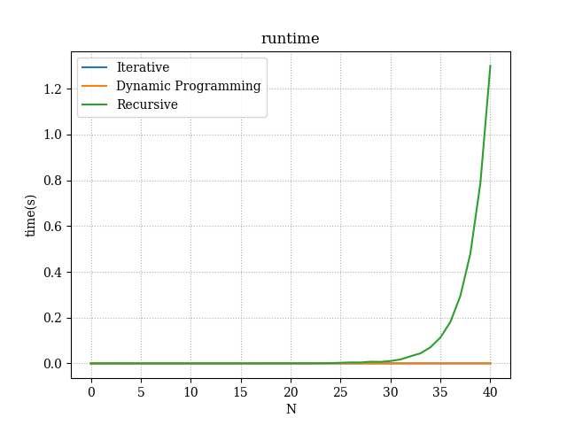
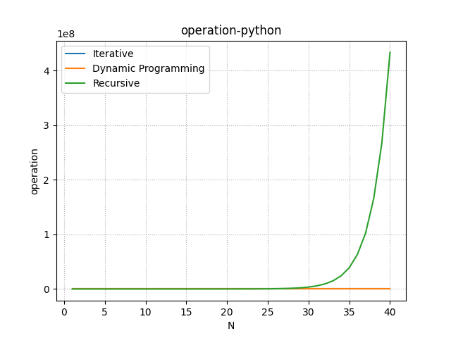
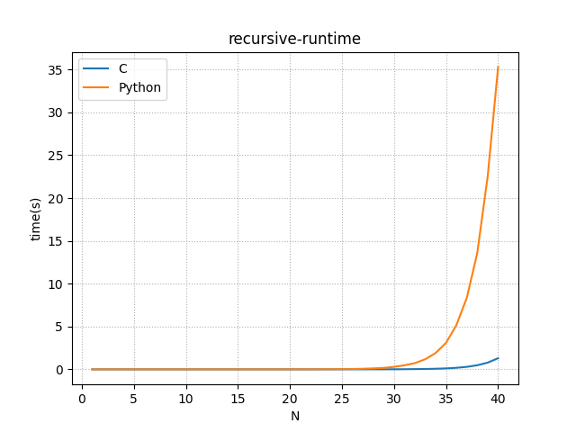
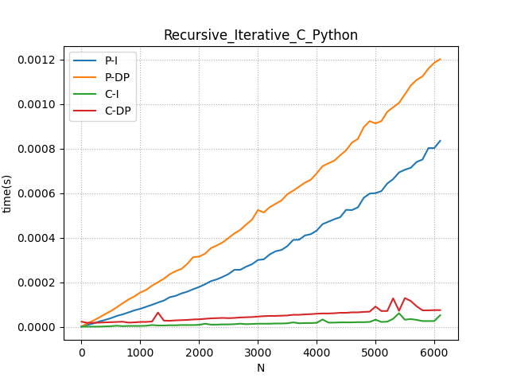

[](https://classroom.github.com/a/kdfTwECC)

# Midterm p1: Report on Analysis of Fibonacci Series

- **Author**: Zhanyi Chen
- **GitHub Repo**: [[linke to github repo with this report](https://github.com/CS5008Fall2025/midterm-report-Ashx-xhsA)]
- **Semester**:25 Spring
- **Languages Used**: c, python

## Overview

This report focuses on the speed differences between implementations of Fibonacci Series<sup>[1]</sup>

The **Fibonacci sequence** is a sequence in which each element is the sum of the two elements that precede it. Numbers that are part of the Fibonacci sequence are known as **Fibonacci numbers**, commonly denoted $F_n$ . Many writers begin the sequence with 0 and 1, although some authors start it from 1 and 1 and some (as did Fibonacci) from 1 and 2. Starting from 0 and 1, the sequence begins:

$$0, 1, 1, 2, 3, 5, 8, 13, 21, 34, 55, 89, 144, ... $$

The Fibonacci numbers may be defined by the recurrence relation<sup>[1]</sup> :

```math
 F_0 = 1, F_1 = 1\\ 

and\\

 F_n = F_{n - 1} + F_{n-2} \

( for \ n > 1)
```

There are multiple ways to implement **Fibonacci sequence** with code, each discussed in more detail below. However,
for the implementations I used in this report the following chart represents the Big O value.

| Version             | Big O    | Space Used |
| :------------------ | :------- | :--------- |
| Iterative           | $O(n)$   | $O(1)$     |
| Recursive           | $O(2^n)$ | $O(n)$     |
| Dynamic Programming | $O(n)$   | $O(n)$     |

- *Iterative*

  The iteratiive method has just one for loop, and maintains 3 variables. 

  ```
  Fib_i(n)
  		fib0 = 0
  		fib1 = 1
  		fib
  		for i=0, i< n, i++
  			fib = fib0 + fib1
  			fib0 = fib1
  			fib1 = fib
  ```

- *recursive*

  The  recurrence tree has n levels, the $i$th level has $2^i$ branches. So time complexity is $2^1 + 2^2 +2^3+...+2^n$, which is  $O(2^n)$. The depth is n so the space complexity is  $O(n)$.

  ```
                   F(n)
                    /\
              F(n-1)    F(n-2)
              /\             /\
       F(n-2)   F(n-3)  F(n-3) F(n-4)
       
         ..........
     F(n-(n-1))  F(n-n)
  ```

  

  ```
  Fib_r(n)
  		if n==0 or n==1 
  			return n
  		return Fib_r(n-1) + Fib_r(n-2)
  ```

  

- *dynamic programming*

  Dp methods stores every value in table, thus the space complexity is $O(n)$. It writes values into table n times thus it calculates n times, so the time complexity is $O(n)$.

  ```
  Fib_d(n)
  		table[0] = 1;
  		table[1] = 1;
  		if (table[n])
  			return table[n]
  		table[n] = table[n-1] + table[n-2]
  		return table[n]
  ```

From time complecity perspective, dynamic gramming is as efficient as iteration method. However iteration method has the smallest space complexity making it overall most efiicient method.

## Empirical Data & Discussion

I ran C to obtain results for n ranging from 0 to 40. Detailed data is provided in the table below： [runtime_c.csv](runtime_c.csv) 

 [operation_count.csv](operation_count.csv).

From the operation count in the table below we can see that the iterative method and dynamic programming have exactly the same number. That's because they all use some extra space(variables, memo table) to store the previous data, thus every index will only be calculated once, which saves a lot of redundant operaction.

Recursive method's operation count is exponential growth. it has redundant steps.

This is a comparison chart of the number of operations performed using C. Iterative and DP overlap：




This is a runtime comparison chart for C implementations. Iterative and DP overlap：




## Language Analysis

### Language 1: C

During my use of the C language, I encountered issues with pointer usage. Initially, I assumed that a for loop couldn't modify the value of an outer variable. After researching, I discovered that the contents of the for loop and the outer scope share the same stack. Pointers are primarily used to pass variables between functions. Another issue was organizing the program into modules and separating the main function. This led to issues with duplicate definitions caused by mutual file references, which I resolved using #ifndef statements.

### Language 2:Python

For the Python program, I primarily modified the Pascal file in midterm-sample. I noticed that the recursive and dynamic programming implementations in Python are nearly identical. The key difference lies in using `@lru_cache` to enable memoization in the `fib_dp` function, thereby avoiding redundant calculations of identical values.

I ran Python to generate results for n ranging from 0 to 40. Detailed data is provided in the table below：

 [timings_fib_run.csv](Python/timings_fib_run.csv) 

 [ops_fib_run.csv](Python/ops_fib_run.csv) 

This is a comparison chart of  the number of operations performed using Python. The iterative approach overlaps with the DP solution:




This is a comparison chart of runtime performance using Python. The iterative approach overlaps with the DP solution:


### Comparison and Discussion Between Experiences


Below is a comparison of runtime between C and Python implementations of the recursive algorithm：



I tested iterative and DP methods within the range of n from 1 to 10000 with a step size of 100. Below is a comparison of runtime between iterative and DP algorithms in C and Python：




## Conclusions / Reflection

Overall, C language is faster than Python. DP simply adds a table to the recursive framework, yet it significantly reduces redundant computations. However, this comes at the cost of some additional space usage. Iterative algorithms are slightly faster than DP, likely because they don't repeatedly consult the table—they only need to examine the two preceding data.

## References

1. Anon. 2025. Fibonacci sequence. (October 2025). Retrieved October 17, 2025 from https://en.wikipedia.org/wiki/Fibonacci_sequence 
